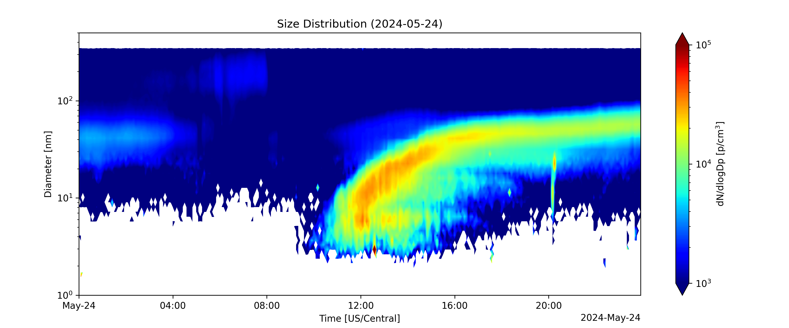

# Particle Sizing Devices (PSD)
The Particle Sizing Devices (PSD) consists of two scanning mobility particle sizers (SMPS) that measure the particle size distribution between 1.5 and 300 nm. Each SMPS has a neutralizer to charge the sampled particles, a differential mobility analyzer to size select the charged particles, and a condensation particle counter to count the sized selected particles. This GUI records the data, and shows a preview of the measured size distribution. The program outputs a raw data file and a rough inverted results file for each SMPS and creates a new file on each time the program starts or the start of a day. 

## Getting Started
### Installing
* Clone the repository
* Install the prerequisite packages `docs\requirements.txt`

## Setup
* Set up config file for each SMPS
    * sample_config.yml has an example of the config file
    * config_template.yml is a commented file explaining each field

## Running
### Data Collection
* GUI can be run with either the `run_smps.py` file or with a `.bat` file
* Data will be saved in the working directory of the executable

### Analysis
* Data needs to be inverted, see (XX et al. XXXX)

## Authors
Contributor names

Darren Cheng

## Version History
### Version 2.0
Working SMPS code
* Includes deadtime
* Removed analysis files. In-built inversion should not be used for final data.

### Version 1.0
Working SMPS code. However...
* Does not count deadtime
* Does not include CPC penetration efficiencies
* Does not include sample tubing losses

## License
This code is licensed under the MIT license
